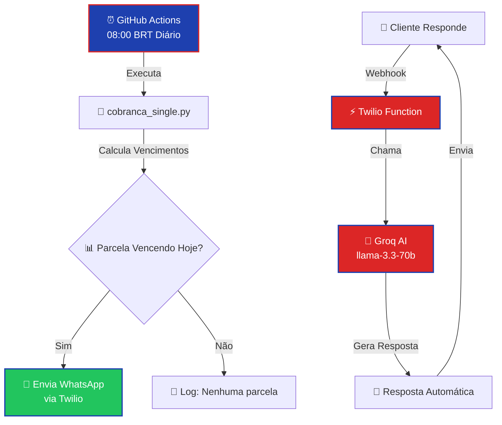

<div align="center">

  

  

  <h1>

    

  </h1>

  

  <samp>Sistema automatizado de cobrança com WhatsApp e IA</samp>

  <br/><br/>

  

  

  

  

  

</div>


<br/>


## `> system.overview()`


```python

class CobrancaAutomatica:

    def __init__(self):

        self.name = "Cobrança Automática"

        self.tagline = "Sistema inteligente de cobrança com WhatsApp e IA"

        self.python_version = "3.11+"

    

    def architecture(self):

        return {

            "core": "Python 3.11",

            "messaging": "Twilio WhatsApp API",

            "ai_engine": "Groq (llama-3.3-70b-versatile)",

            "automation": "GitHub Actions (scheduled)",

            "webhook": "Twilio Functions (serverless)"

        }

    

    def capabilities(self):

        return [

            {"feature": "Cálculo Automático de Parcelas", "icon": "📅"},

            {"feature": "Ajuste para Dias Úteis", "icon": "📆"},

            {"feature": "Cálculo de Multa e Juros", "icon": "💰"},

            {"feature": "Envio Automático WhatsApp", "icon": "💬"},

            {"feature": "Chatbot com IA", "icon": "🤖"},

            {"feature": "Resposta Automática", "icon": "⚡"}

        ]

    

    def differentiators(self):

        return [

            "Vencimento baseado em dias úteis (N dias após início do mês)",

            "Chatbot inteligente com Groq AI para responder dúvidas",

            "Twilio Functions serverless (sem servidor 24/7)",

            "Execução automática via GitHub Actions",

            "Respostas automáticas em tempo real via webhook",

            "Cálculo preciso de juros compostos e quitação antecipada"

        ]

```


<br/>


## `> tech_stack`


<div align="center">

  

</div>


<table align="center">

<tr>

<td align="center" width="33%">

<strong>🐍 Core & Processing</strong><br/><br/>


</td>

<td align="center" width="33%">

<strong>💬 Messaging & AI</strong><br/><br/>


</td>

<td align="center" width="33%">

<strong>⚡ Automation</strong><br/><br/>


</td>

</tr>

</table>


<br/>


## `> key_features`


<table align="center">

<tr>

<td align="center" width="25%">

<strong>📅 Cálculo Inteligente</strong><br/><br/>

<samp>

Vencimentos calculados como <strong>N dias úteis após início do mês</strong>. Ajuste automático para feriados e finais de semana.

</samp>

</td>

<td align="center" width="25%">

<strong>💰 Multa e Juros</strong><br/><br/>

<samp>

Cálculo preciso de <strong>multa (2%) e juros compostos (1% ao mês)</strong> com pro rata diário.

</samp>

</td>

<td align="center" width="25%">

<strong>💬 Chatbot IA</strong><br/><br/>

<samp>

Responde automaticamente dúvidas sobre dívida, parcelas e pagamentos usando <strong>Groq AI (llama-3.3-70b)</strong>.

</samp>

</td>

<td align="center" width="25%">

<strong>⚡ Automatizado</strong><br/><br/>

<samp>

<strong>GitHub Actions</strong> executa diariamente. <strong>Twilio Functions</strong> responde em tempo real via webhook.

</samp>

</td>

</tr>

</table>


<br/>


## `> installation`


### Prerequisites


<table align="center">

<tr>

<td align="center">

<br/>

<samp>Python 3.11+</samp>

</td>

<td align="center">

<br/>

<samp>Conta Twilio</samp>

</td>

<td align="center">

<br/>

<samp>API Key Groq</samp>

</td>

<td align="center">

<br/>

<samp>GitHub Repository</samp>

</td>

</tr>

</table>


### Quick Start


```bash

# 1. Clone o repositório

git clone https://github.com/cauafigueredo15-oss/cobranca-automatica.git

cd cobranca-automatica


# 2. Instale dependências

pip install -r requirements.txt


# 3. Configure variáveis de ambiente

# Crie um arquivo .env ou configure no GitHub Secrets:

# TWILIO_ACCOUNT_SID=seu_sid

# TWILIO_AUTH_TOKEN=seu_token

# TWILIO_FROM=+14155238886

# GROQ_API_KEY=sua_chave_groq

# DEBTOR_PHONE=+558488910528

# PIX_KEY=84988910528


# 4. Execute localmente (teste)

python cobranca_single.py
```


### Configuração GitHub Actions


1. **Adicione Secrets no GitHub:**

   - Settings → Secrets and variables → Actions

   - Adicione: `TWILIO_ACCOUNT_SID`, `TWILIO_AUTH_TOKEN`, `TWILIO_FROM`, `GROQ_API_KEY`

2. **O workflow executa automaticamente:**

   - Diariamente às 08:00 BRT (envio de cobranças)

   - Respostas automáticas via Twilio Functions (webhook em tempo real)


### Configuração Twilio Functions (Webhook)


1. **Crie Twilio Function:**

   - Functions & Assets → Services → Create Service

   - Adicione Function com código de `twilio-function.js`

2. **Configure Environment Variables:**

   - `GROQ_API_KEY`, `DEBTOR_NAME`, `INSTALLMENT_VALUE`, `PIX_KEY`, etc.

3. **Configure Webhook:**

   - WhatsApp Sandbox → Sandbox settings

   - "When a message comes in" → URL da Function

   - Método: POST


<br/>


## `> architecture_flow`


<div align="center">





</div>


<br/>


## `> project_structure`


```

cobranca-automatica/

│

├── 📄 cobranca_single.py          # Sistema principal de cobrança

├── 🤖 chatbot_simples.py          # Chatbot com Groq AI

├── ⚡ twilio-function.js          # Twilio Function (webhook serverless)

├── 🌐 webhook.py                  # Webhook Flask (alternativa)

│

├── ⚙️ .github/

│   └── workflows/

│       └── cobranca_single.yml    # Workflow: envio diário

│

├── 📦 requirements.txt            # Dependências Python

└── 📖 README.md                   # Este arquivo

```


<br/>


## `> configuration`


### Variáveis de Ambiente


```bash

# Configurações de Cobrança

START_YEAR=2026

START_MONTH=1

BUSINESS_DAYS_AFTER_MONTH_START=5  # 5º dia útil do mês

INSTALLMENTS=6

INSTALLMENT_VALUE=386.56

DEBTOR_NAME=Samuel Cassiano de Carvalho

DEBTOR_PHONE=+558488910528

PIX_KEY=84988910528

TIMEZONE=America/Sao_Paulo

MULTA_PERCENT=2.0

INTEREST_MONTHLY_PERCENT=1.0

GRACE_DAYS=0

CURRENCY=BRL


# Twilio

TWILIO_ACCOUNT_SID=seu_account_sid

TWILIO_AUTH_TOKEN=seu_auth_token

TWILIO_FROM=+14155238886

WHATSAPP_PROVIDER=twilio


# Groq AI

GROQ_API_KEY=sua_chave_groq
```


<br/>


## `> features`


### 💳 Sistema de Cobrança


- ✅ **Cálculo de Vencimentos**: N dias úteis após início do mês

- ✅ **Ajuste Automático**: Feriados e finais de semana

- ✅ **Multa e Juros**: Cálculo preciso com pro rata diário

- ✅ **Mensagens Formatadas**: Lista completa de parcelas com status

- ✅ **Informação PIX**: Chave PIX incluída automaticamente


### 🤖 Chatbot Inteligente


- ✅ **Resposta Automática**: Via Twilio Functions (serverless)

- ✅ **IA Avançada**: Groq llama-3.3-70b-versatile

- ✅ **Contexto Atualizado**: Informações da dívida em tempo real

- ✅ **Cálculos Financeiros**: Entende juros compostos e quitação antecipada

- ✅ **Fallback Inteligente**: Respostas automáticas se IA falhar


### ⚡ Automação


- ✅ **GitHub Actions**: Execução diária automática (envio de cobranças)

- ✅ **Twilio Functions**: Webhook serverless para respostas em tempo real

- ✅ **Sem Servidor 24/7**: Tudo serverless/gratuito

- ✅ **Logs Detalhados**: Rastreamento completo de operações


<br/>


## `> usage`


### Execução Manual


```bash

# Modo teste (não envia mensagens)

TEST_MODE=true python cobranca_single.py


# Forçar data de vencimento (para testes)

NOW_OVERRIDE=2026-01-05 python cobranca_single.py


# Modo produção (envia mensagens reais)

TEST_MODE=false python cobranca_single.py
```


### Execução Automática


O sistema executa automaticamente:

- **08:00 BRT diariamente** (GitHub Actions): Envia cobranças para parcelas vencendo

- **Tempo real** (Twilio Functions): Responde mensagens recebidas via webhook


### Exemplo de Mensagem Enviada


```
💳 *Cobrança*

*Samuel Cassiano de Carvalho*
BRL 2.319,36 (6x de BRL 386,56)

━━━━━━━━━━━━━━━━━━━━

05 Jan - BRL 386,56 📅
05 Fev - BRL 386,56
05 Mar - BRL 386,56
...

━━━━━━━━━━━━━━━━━━━━

📌 *Parcela 1 vencendo:*
💵 BRL 386,56
📅 05/01/2026

━━━━━━━━━━━━━━━━━━━━

💸 *Forma de Pagamento:*

📱 *PIX:*
`84988910528`

Por favor, efetue o pagamento.
```


<br/>


## `> license`


<div align="center">


</div>


<br/>


<div align="center">

  

</div>
